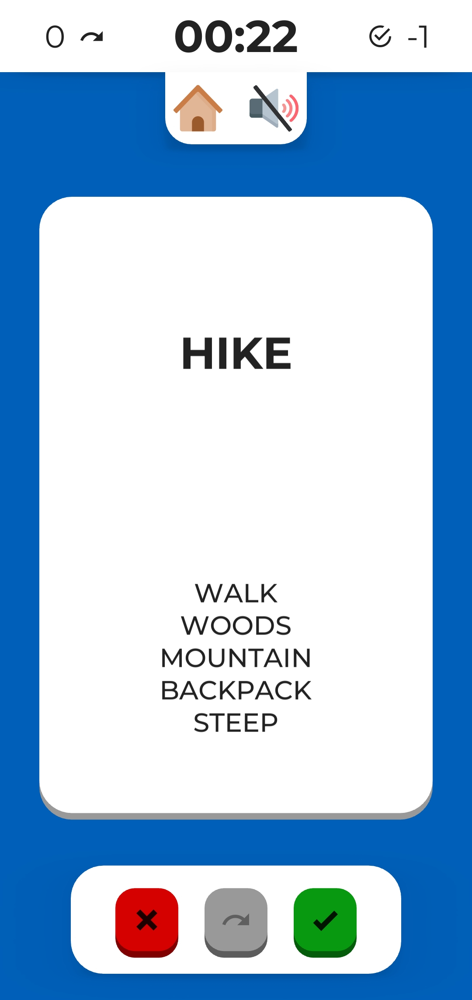
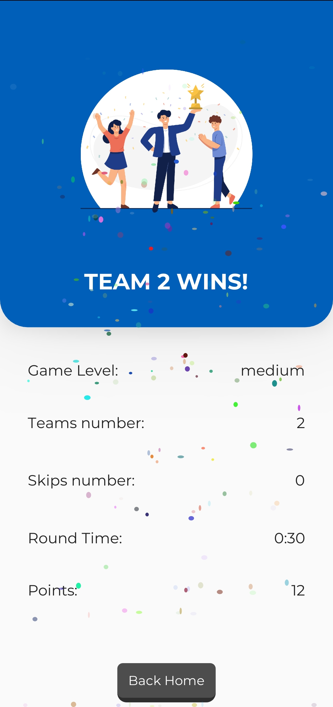
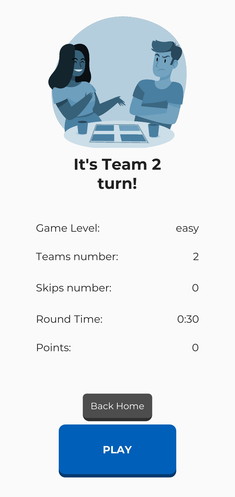
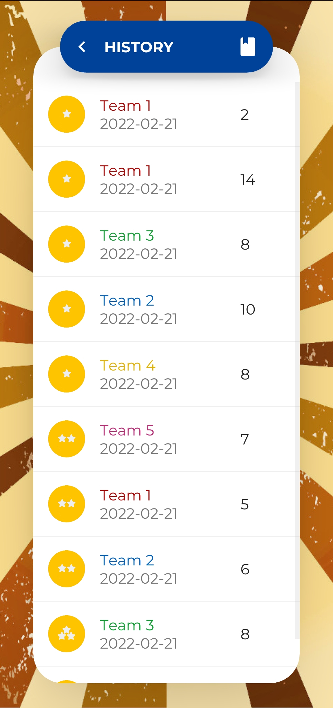
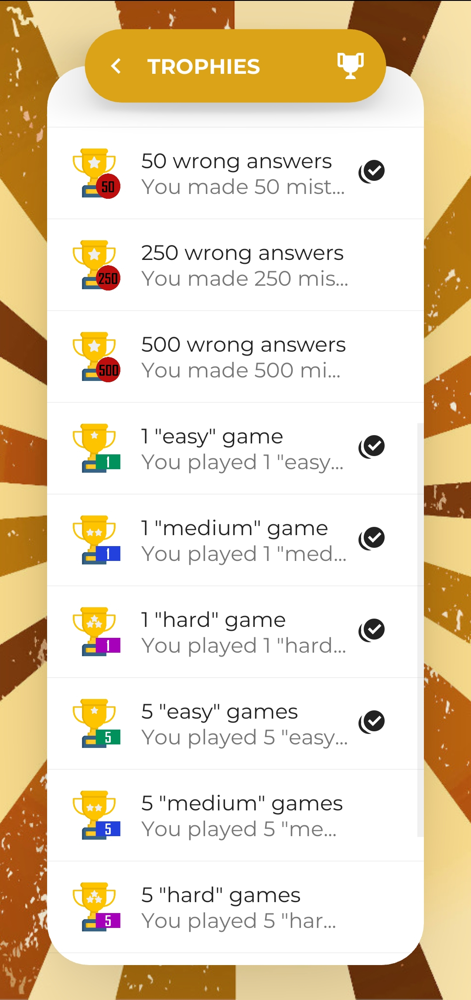
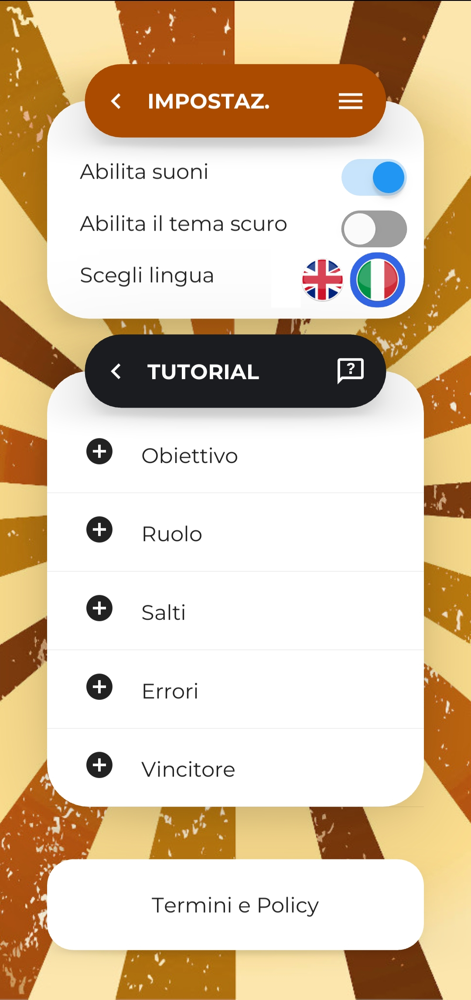

# Kaboo

[](https://play.google.com/store/apps/details?id=org.kames.kaboo&hl=en_US&gl=US)


Kaboo is a great game to hang out and have fun with friends! 
At least 2 teams of 2 people are required to play and one person must 
make the other of his team guess the words, avoiding saying the forbidden ones!

> Kaboo is available on <a href="https://play.google.com/store/apps/details?id=org.kames.kaboo&hl=en_US&gl=US">Play Store</a>.

<table>
  <tr>
     <td><b>PRE GAME screen</b></td>
     <td><b>GAME screen</b></td>
     <td><b>END GAME screen</b></td>
  </tr>
  <tr>
    <td></td>
    <td></td>
    <td></td>
  </tr>
   <tr>
     <td><b>HISTORY screen</b></td>
     <td><b>TROPHIES screen</b></td>
     <td><b>SETTINGS screen</b></td>
  </tr>
  <tr>
    <td></td>
    <td></td>
    <td></td>
  </tr>
 </table>


**DISCLAIMER**:
This is not official Taboo / Tabu game! Kaboo is not associated with Hasbro or 
Hersch and Company's Taboo ( Tabou, Tabù, Tabuh, Tabu ) or any other variants 
of the Taboo products registered trademarks.


## How to play
- **GOAL**: Kaboo is a team game where players describe words to their teammates without mentioning any of the words listed. The team that guesses the most words wins!
- **ROLE**: In each turn, one team guesses and the others watch. In the team that guesses, the Prompter best describes the word on paper, while the teammates guess what it is. Teams alternate roles at each turn.
- **SKIP**: If the Prompter is stuck, you can press the Skip button to switch to the next word. Be careful: the skip action can only be used for a limited number of times!
- **MISTAKES**: If the Prompter breaks any of the rules, he must mark the word as a mistake and move on to the next word. The score will be decreased by 1.
- **WINNER**: At the end of the game, the winning team is the one with the most points!

## Dev Section
### Build the app with Docker
Use the docker container as specified in the guide.
Clone the repository (in other directory) from the official repo and run the build command.

```bash
git clone https://github.com/kivy/buildozer
cd buildozer
docker build --tag=buildozer .
```

When you change the `buildozer.spec` you always need to run a `buildozer appclean`.
Then you can 
```bash
docker run --volume "<absolute_path>":/home/user/hostcwd buildozer appclean
docker run --volume "<absolute_path>":/home/user/hostcwd buildozer android debug # choose (debug|release) 
```

#### Build the app with aab support
```bash
git clone --single-branch --branch feat/aab-support https://github.com/misl6/buildozer.git
cd buildozer
docker build --tag=buildozer-aab .
```
Make sure you have in your `buildozer.spec`, the following lines:  
```
android.archs = arm64-v8a, armeabi-v7a
android.release_artifact = aab
p4a.branch = develop
```

Create a keystore (do it on Windows, not WSL!)
```bash
KEYSTORE_NAME=kaboo
KEYSTORE_ALIAS=kabooalias
mkdir -p ./keystores/
keytool -genkey -v -keystore ./keystores/${KEYSTORE_NAME}.keystore -alias ${KEYSTORE_ALIAS} -keyalg RSA -keysize 2048 -validity 75000
keytool -importkeystore -srckeystore ./keystores/${KEYSTORE_NAME}.keystore -destkeystore ./keystores/${KEYSTORE_NAME}.keystore -deststoretype pkcs12
```

```bash
KEYSTORE_NAME=kaboo
KEYSTORE_ALIAS=kabooalias
# replace here with your keystore pass
KEYSTORE_PASS=
KEYALIAS_PASS=
docker run --volume "<absolute_path>":/home/user/hostcwd buildozer-aab -v init
docker run --volume "<absolute_path>":/home/user/hostcwd buildozer-aab appclean
docker run \
     --volume "<absolute_path>":/home/user/hostcwd \
     --volume "<absolute_path>\keystores":/home/user/keystores \
     -e P4A_RELEASE_KEYSTORE=/home/user/keystores/${KEYSTORE_NAME}.keystore \
     -e P4A_RELEASE_KEYSTORE_PASSWD=${KEYSTORE_PASS} \
     -e P4A_RELEASE_KEYALIAS_PASSWD=${KEYALIAS_PASS} \
     -e P4A_RELEASE_KEYALIAS=${KEYSTORE_ALIAS} \
     buildozer-aab -v android release
```
##### Verify the aab with Bundletools + ADB
Put your generated .aab file into the bin folder. 
Verify
```bash
bundletool validate --bundle bin/kaboo-release.aab
```
Create APK 
To have it signed you have to pass also keystore
```bash
bundletool build-apks --mode universal --bundle bin/kaboo-release.aab --output bin/kaboo-release.apks --ks keystores/{KEYSTORE_NAME}.keystore --ks-key-alias {KEYSTORE_ALIAS} --ks-pass pass:{KEYSTORE_PASS}
```
Install
```bash
bundletool install-multi-apks --apks bin/kaboo-release.apks
```

### Debug with android
```bash
adb devices  # ensures the device is connected and appears in the list
adb logcat | findstr com.kames.kaboo  # or python
```